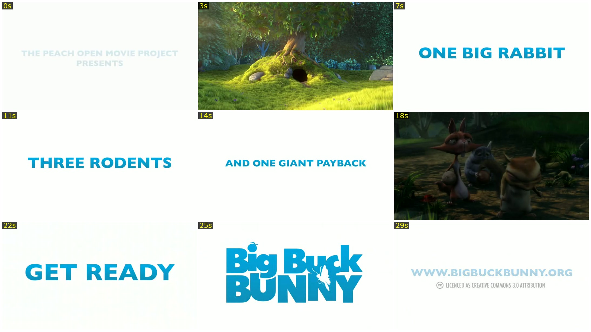

# claude-video-digest

Turns any video into a readable digest: a timestamped contact sheet, individual frames, and a
transcript grouped under the frame each line was spoken over. Claude can't play video — this
gives it something it can actually read.


_Nine frames from a 33-second public-domain clip ([Big Buck Bunny](https://www.bigbuckbunny.org),
CC BY 3.0), each labelled with its approximate timestamp._

## What this does that the existing video-watching tools don't

A couple of good ones already do the general job. Four things here are specific to this one —
each followed by what the other two do instead:

- **A contact sheet labelled with timestamps.** One tile per sampled moment, each stamped with
  when it happened, so a single image places every event on the clip's timeline. _Elsewhere:_
  one tool emits no sheet at all; the other tiles frames labelled with filenames, not with when
  they happened.
- **The transcript is grouped under the frame each line was spoken over.** Speech and screen
  state arrive already correlated, as one artifact. _Elsewhere:_ both keep them separate, and
  lining them up is left to you.
- **The transcriber runs only when the audio actually carries signal**, measured as loudness
  rather than inferred from the track existing. _Elsewhere:_ both check only that an audio
  stream is present — so both will happily transcribe a digitally-silent screen recording (a
  recorder writes such a track when the mic is off) and hand you hallucinated captions.
- **The share hosts screen-recording tools actually use are supported**: Zight and CloudApp,
  verified. This tool scrapes them directly by looking for an embedded `.mp4` on the page, and
  falls back to yt-dlp (if installed) for everything yt-dlp does support — YouTube, Loom, Vimeo,
  and hundreds more. _Elsewhere:_ both are built entirely on yt-dlp, which doesn't know those
  hosts, so neither can open such a link at all.

So it isn't a competing "let AI watch video" tool; it's the one that also handles the
recordings the others can't open.

**Droplr** is expected to work the same way (same `d.pr` short-link, same embedded-video page
shape) but is **unverified** — no live Droplr link was available to test against. If you try it
and it works (or doesn't), an issue with the link (or a redacted screenshot of the failure) is
useful.

## A note on fetching URLs

Given a URL, the scraper follows a second URL taken from *that page's own content* to find the
video — which means the page, not just you, has a say in what gets requested next. This is
bounded (only `http(s)` is followed, redirects are capped) but not eliminated: pointing this
tool at a URL you don't trust carries the same class of risk as pointing `curl -L` at one. Treat
it accordingly — it's built for share links from people you're already working with, not for
arbitrary URLs from the internet.

## Install

As a Claude Code plugin:

```
/plugin marketplace add anaidenko/claude-video-digest
/plugin install claude-video-digest
```

Or run the script directly — it has no plugin-specific dependency:

```bash
git clone https://github.com/anaidenko/claude-video-digest.git
./claude-video-digest/scripts/video-digest.sh <url-or-file>
```

Check what's installed and what's missing:

```bash
./scripts/video-digest.sh doctor
```

**Required:** `ffmpeg`, `ffprobe`, `python3`. **Optional:** `curl` (only for a URL input),
`whisper` (transcription — skipped, not an error, without it), `yt-dlp` (sites the built-in
scraper can't resolve).

## Use

```bash
./scripts/video-digest.sh <url|file.mp4> [options]
```

The skill (`skills/watch-video/SKILL.md`) does this automatically inside Claude Code whenever a
video is relevant to what you're doing — you don't need to remember the command.

Output, per recording, in its own directory:

```
contact-sheet.jpg   read this first — one image, the whole clip
frames/              individual frames, full resolution
transcript.txt       only when the audio carries signal, grouped by frame
source.url           only for a URL input
meta.json            what was extracted and how
source.mp4            kept or deleted depending on keepSource (see below)
```

## Where output goes

By default, the **OS temp directory** — nothing lands in your project. Pass `--output <dir>` (or
set `"output"` in the config) to use a persistent directory instead, which is what makes caching
and a kept `source.mp4` worth anything. Re-running the same input reuses what's already there.

If the resolved output directory sits inside a git repo and isn't gitignored, the tool prints a
one-line suggestion — it never prompts. A tool Claude runs must not wait on a question no one is
there to answer.

## Configuration

Three layers, later wins: built-in defaults → config file → CLI flags. Config file is
`.video-digest.json` in the current directory, or `~/.config/video-digest/config.json`.

| Key | Default | What it does |
| --- | --- | --- |
| `output` | OS temp dir | where recordings are written |
| `maxFrames` | derived from duration | hard cap on frame count |
| `secondsPerFrame` | `4.5` | target sampling density before the floor/ceiling |
| `framesFloor` / `framesCeiling` | `10` / `30` | bounds on the derived frame count |
| `minInterval` | `1` | minimum seconds between kept frames |
| `sampleFps` | `2` | pre-dedupe sampling rate |
| `dedupe` | `true` | drop near-identical frames (scene-change based), not just evenly spaced |
| `contactSheet` | `true` | produce the tiled sheet |
| `frames` | `true` | write individual frame files |
| `transcript` | `"auto"` | `"auto"` gates on measured loudness, `"always"` forces it, `"never"` skips it |
| `keepSource` | `"auto"` | `"auto"` deletes in the temp-dir default, keeps in a persistent one |
| `silenceFloorDb` | `-60` | loudness threshold for the `"auto"` transcript gate |
| `cellArea` | `480000` | contact-sheet cell size budget, in pixels² (area, not width — see CLAUDE.md) |
| `jpegQuality` | `2` | ffmpeg `-q:v` for the sheet |
| `whisperModel` | `"base"` | Whisper model size |

The commonly-changed keys have a CLI flag in kebab-case (`--max-frames`, `--transcript always`,
`--no-dedupe`, ...) — see `--help` for the full list. The rest (`secondsPerFrame`,
`framesFloor`/`framesCeiling`, `cellArea`, `jpegQuality`, `silenceFloorDb`, `whisperModel`) are
config-file-only; they're tuning knobs rather than per-run choices.

## Verified platforms

- **macOS** — native, no container needed.
- **Linux** — verified in `debian:bookworm-slim` via the included `Dockerfile`.
- **Windows** — not tested. Expected to work under Docker Desktop / WSL2; not claimed until
  someone runs it and reports back.

```bash
docker build -t video-digest .
docker run --rm -v "$PWD:/work" -w /work video-digest <input> --output /work/out
```

## License

MIT — see [LICENSE](LICENSE).
