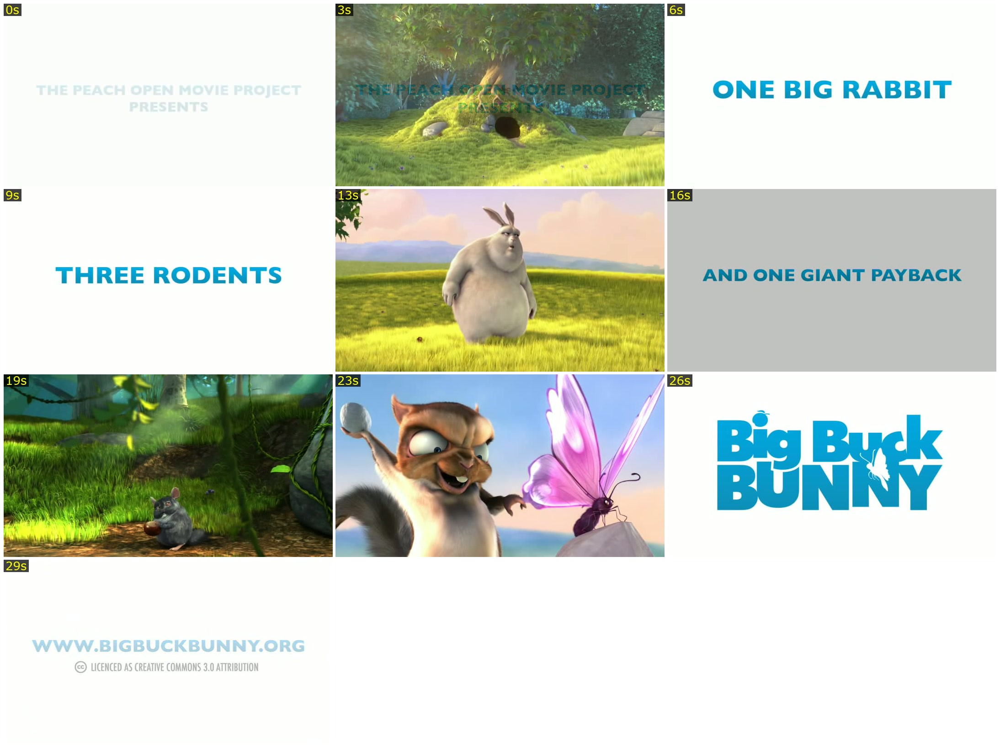

# claude-video-digest

Turns any video into a readable digest: a timestamped contact sheet, individual frames, and a
transcript grouped under the frame each line was spoken over. Claude can't play video — this
gives it something it can actually read.



_Ten frames from a 33-second public-domain clip ([Big Buck Bunny](https://www.bigbuckbunny.org),
CC BY 3.0). That clip has no narration; here's the transcript half, from a narrated one:_

```
frame_001.jpg  [0:00 - 0:05]
    (0:00) Now look into space to the moon and to the planets beyond, and we have vowed that we shall

frame_003.jpg  [0:09 - 0:13]
    —

frame_005.jpg  [0:17 - 0:21]
    (0:17) We have vowed that we shall not see space filled with weapons of mass destruction, but
```

Full output from both runs — every frame, complete transcript, `meta.json` — in
[`docs/example-output/`](docs/example-output/).

## Use

Inside Claude Code, just ask — the bundled skill runs it for you:

> watch this: https://d.pr/v/abc123
>
> what does the recording in this ticket show?

Or run it directly:

```bash
# A share link (Zight, CloudApp, Droplr) or any page with an embedded video
./scripts/video-digest.sh https://d.pr/v/abc123

# A local file
./scripts/video-digest.sh ./recording.mp4

# Keep the output instead of writing to the OS temp dir
./scripts/video-digest.sh <url> --output ./tmp-media

# More frames when a sequence matters (deletes, reordering, fast interactions)
./scripts/video-digest.sh <url> --max-frames 40 --no-dedupe

# Just the transcript, no images
./scripts/video-digest.sh <url> --no-contact-sheet --no-frames

# Label the output directory
./scripts/video-digest.sh <url> --ticket 1234 --title "login fails on submit"

# What's installed, what's missing
./scripts/video-digest.sh doctor
```

Each run produces a directory:

```
contact-sheet.jpg   read this first — one image, the whole clip
frames/             individual frames, full resolution
transcript.txt      only when the audio carries signal, grouped by frame
source.url          only for a URL input
meta.json           what was extracted, and the real recording date
source.mp4          kept or deleted depending on keepSource
```

## Install

As a Claude Code plugin:

```
/plugin marketplace add anaidenko/claude-video-digest
/plugin install claude-video-digest
```

Or standalone — it's a bash script with no plugin-specific dependency:

```bash
git clone https://github.com/anaidenko/claude-video-digest.git
./claude-video-digest/scripts/video-digest.sh <url-or-file>
```

**Required:** `ffmpeg`, `ffprobe`, `python3`. **Optional:** `curl` (URL inputs), `whisper`
(transcription — skipped, not an error, without it), `yt-dlp` (YouTube, Loom, Vimeo and
hundreds more). `doctor` tells you what you're missing.

**Platforms:** macOS and Linux, both verified. Windows untested — expected to work under
Docker Desktop / WSL2, but not claimed until someone confirms it. A `Dockerfile` is included:

```bash
docker build -t video-digest .
docker run --rm -v "$PWD:/work" -w /work video-digest <input> --output /work/out
```

## Configuration

Defaults work with no config. To change them: `.video-digest.json` in the working directory, or
`~/.config/video-digest/config.json`. CLI flags win over both.

| Key | Default | What it does |
| --- | --- | --- |
| `output` | OS temp dir | where recordings are written |
| `maxFrames` | derived from duration | hard cap on frame count |
| `secondsPerFrame` | `4.5` | sampling density before floor/ceiling |
| `framesFloor` / `framesCeiling` | `10` / `30` | bounds on the derived count |
| `minInterval` | `1` | minimum seconds between kept frames |
| `sampleFps` | `2` | pre-dedupe sampling rate |
| `dedupe` | `true` | drop near-identical frames rather than sampling evenly |
| `contactSheet` / `frames` | `true` | produce the sheet / write frame files |
| `transcript` | `"auto"` | `auto` gates on measured loudness; `always`; `never` |
| `keepSource` | `"auto"` | `auto` deletes in a temp dir, keeps in a persistent one |
| `silenceFloorDb` | `-60` | threshold for the `auto` transcript gate |
| `cellArea` | `480000` | contact-sheet cell size budget, in pixels² |
| `jpegQuality` | `2` | ffmpeg `-q:v` for the sheet |
| `whisperModel` | `"base"` | Whisper model size |

The commonly-changed keys have a CLI flag (`--max-frames`, `--transcript always`,
`--no-dedupe`, …); see `--help`. The rest are config-file-only tuning knobs.

## Why this exists

A couple of good video-watching tools already exist. Four things here are specific to this one —
each followed by what the others do instead:

- **A contact sheet labelled with timestamps.** One image places every event on the clip's
  timeline. _Elsewhere:_ one tool emits no sheet; the other tiles frames labelled with
  filenames, not times.
- **The transcript is grouped under the frame each line was spoken over**, so speech and screen
  state arrive already correlated. _Elsewhere:_ both keep them separate.
- **Transcription runs only when the audio carries signal**, measured as loudness. _Elsewhere:_
  both check only that an audio stream exists — so both will transcribe a digitally-silent
  screen recording (recorders write such a track when the mic is off) and return hallucinated
  captions.
- **The share hosts screen-recording tools actually use work**: Zight, CloudApp and Droplr, all
  verified against live links. _Elsewhere:_ both are built entirely on yt-dlp, which doesn't
  know those hosts, so neither can open such a link at all.

For everything yt-dlp *does* support, this falls back to it — so you get both.

## A note on fetching URLs

Given a URL, the scraper follows a second URL taken from *that page's own content* to find the
video — the page, not just you, has a say in what gets requested next. This is bounded (only
`http(s)`, redirects capped) but not eliminated: pointing this at a URL you don't trust carries
the same class of risk as `curl -L`. It's built for share links from people you're working
with, not arbitrary URLs.

## License

MIT — see [LICENSE](LICENSE). Contributions welcome; see [CONTRIBUTING.md](CONTRIBUTING.md).
